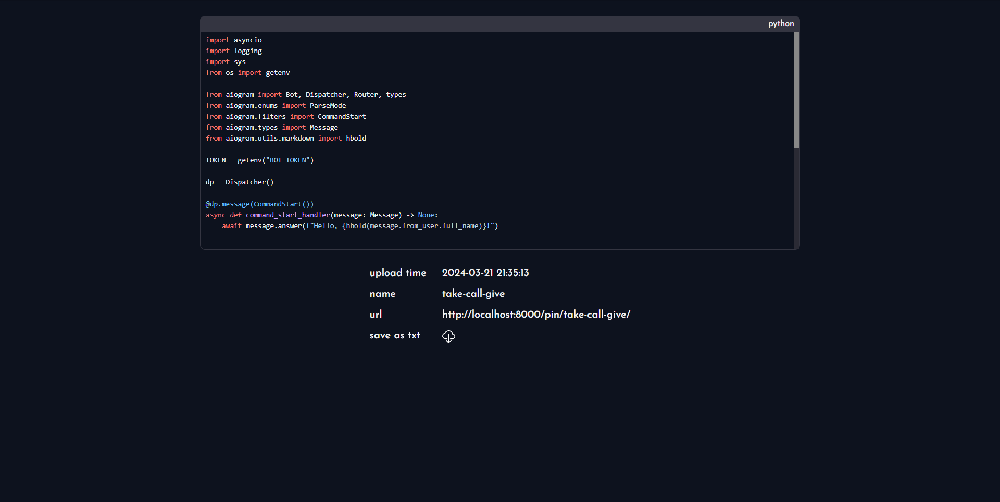
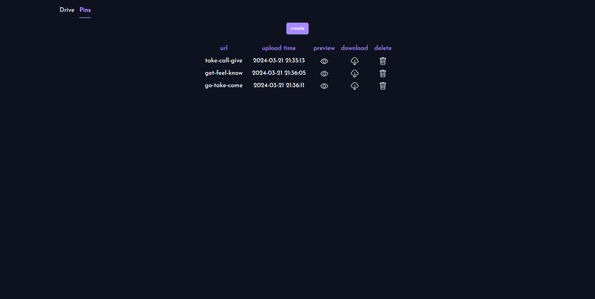
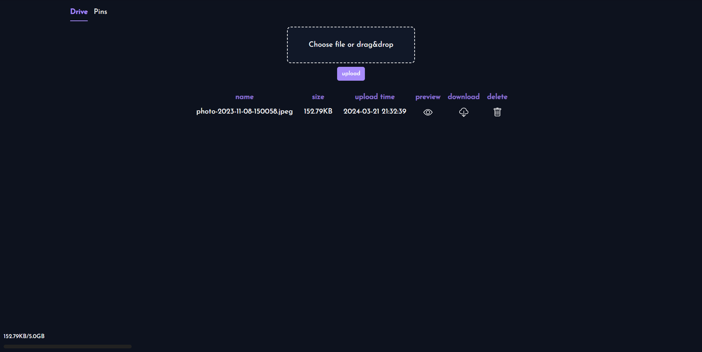

# GNoteBin

**GNoteBin** is a service for storing notes(text/code) or files and viewing them. The notes are saved to the database. The files are saved on [filebase](https://filebase.com/). There is a view of the code/text/photo.

